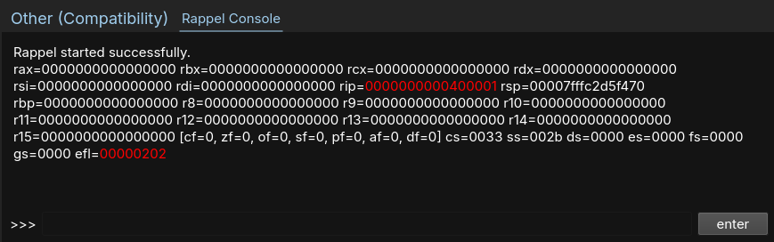

# rappel-binja
rappel-binja is a plugin for binary-ninja that brings rappel in it's very own widget on the UI, and this automatically. It was designed to enhance interactive static reverse-engineering and assembly analysis.



> Rappel is a pretty janky assembly REPL. It works by creating a shell ELF, starting it under ptrace, then continiously rewriting/running the .text section, while showing the register states. It's maybe half done right now, and supports Linux x86, amd64, armv7 (no thumb), and armv8 at the moment.

The plugin is still in very-early stage of development, but for now I consider it working and suitable for use.

There's one slightly issue at the moment, for the plugin to work you need a special build of rappel, this is because rappel buffering will cause our process to hang forever (waiting for input or to send output) without the fork I provide.

## Build and Install Rappel
The only dependency is an assembler (`nasm` on x86/amd64, `as` on ARM), which on debian can be installed with the `nasm`/`binutils` packages.

First clone the repo:
```
git clone https://github.com/algoatson/rappel
cd rappel
```

Then build rappel:
```
CC=clang make
```
It should work fine with `gcc`, albeit with a few more warnings.

By default rappel is compiled with your native architecture. If you're on amd64 and want to target x86 you can do this with:
```
ARCH=x86 CC=clang make
```
In theory you can also compile an armv7 binary this way, but I really doubt it will work. For rappel to function, the architecture of the main rappel binary must match that of the process it creates, and the host must be able to run binaries of this architecture.

Now that you have rappel built and ready-to-run, move it to a location that is in your `PATH` environment variable.

psifer send me a license please 🥺

email: cs.kilian@proton.me
